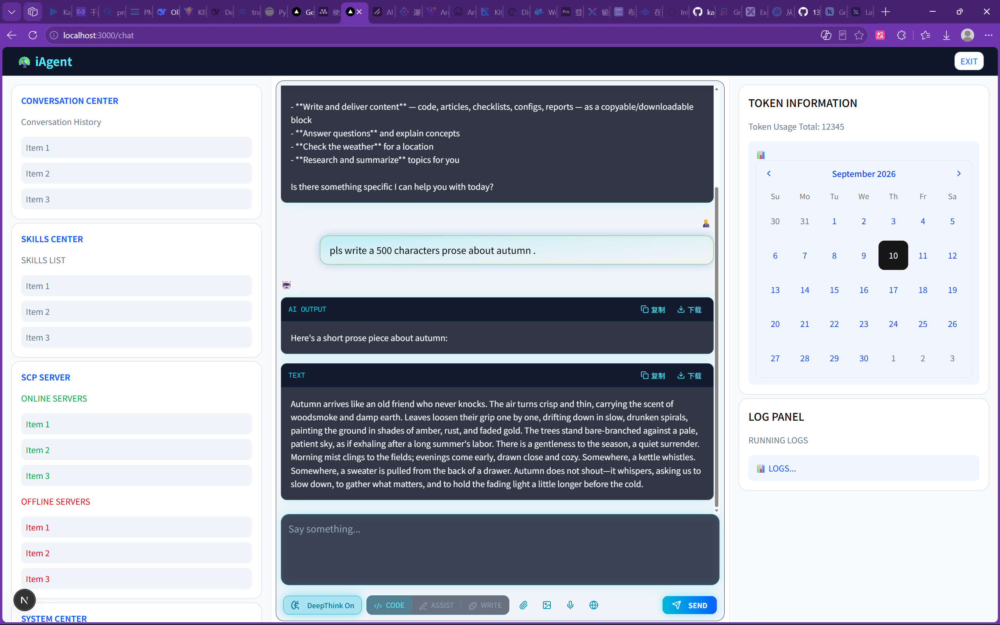
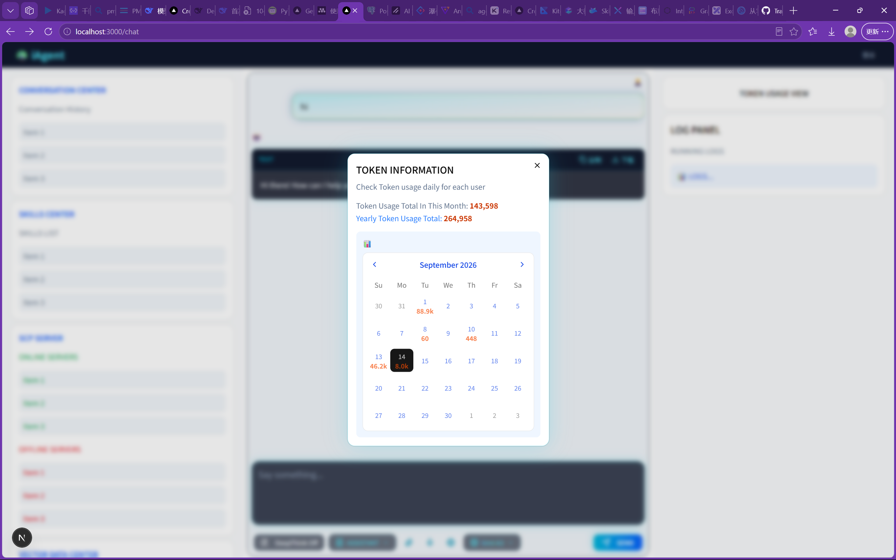
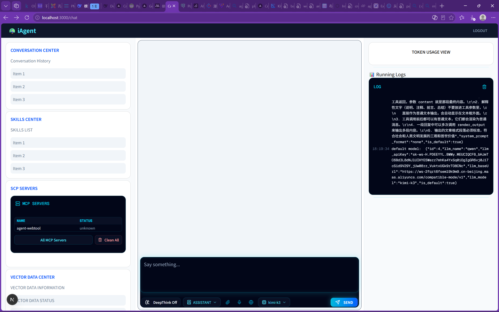
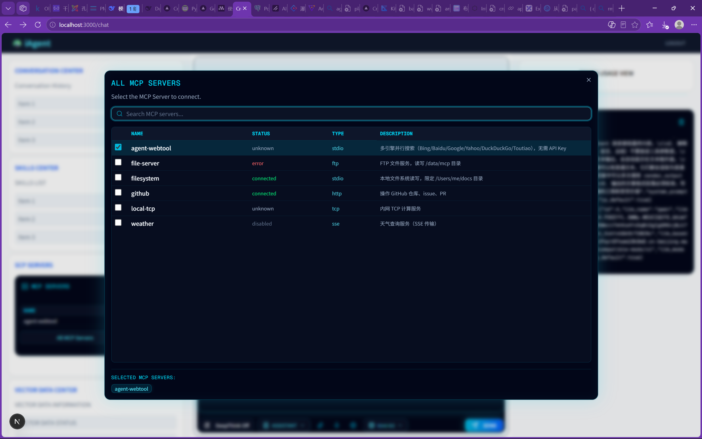
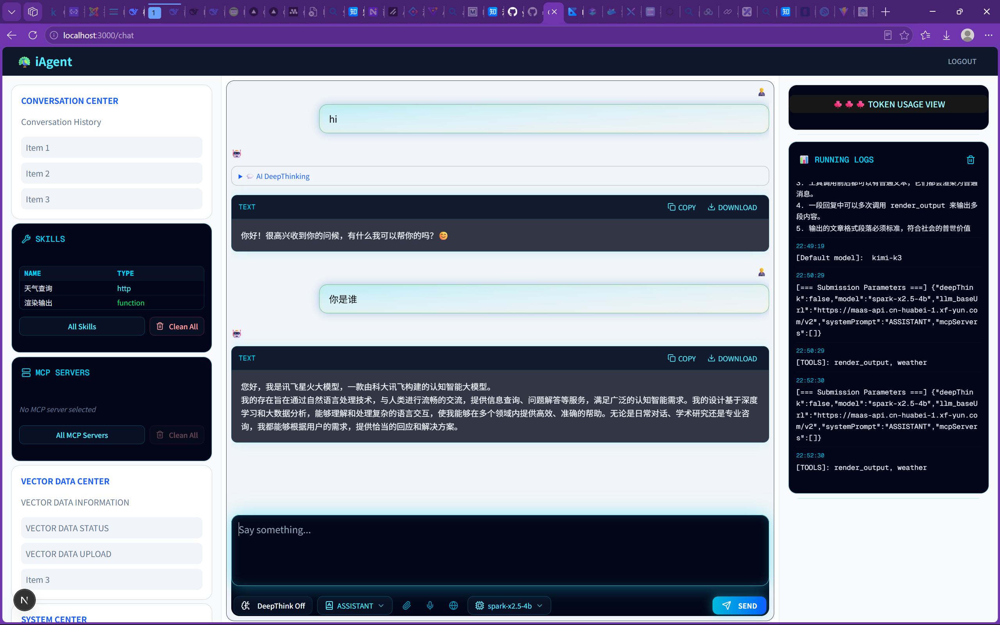
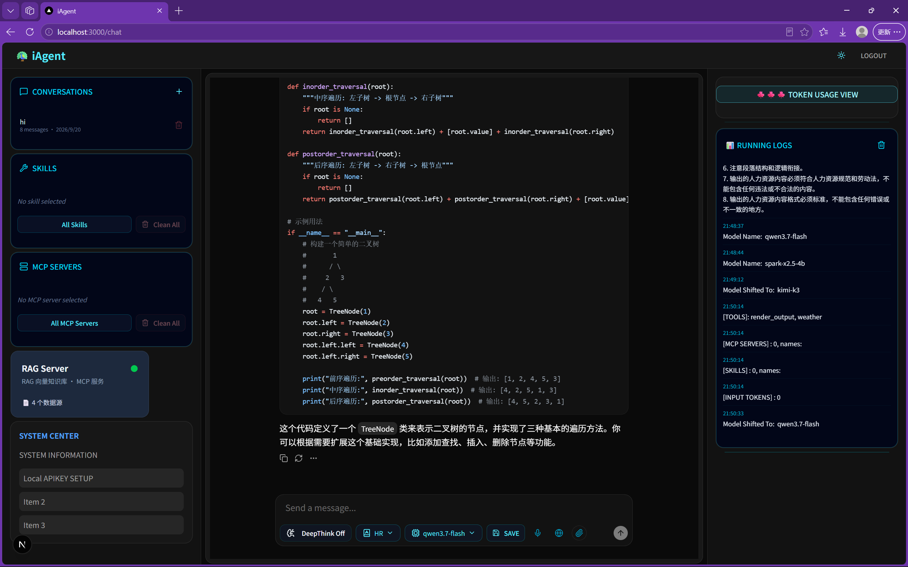
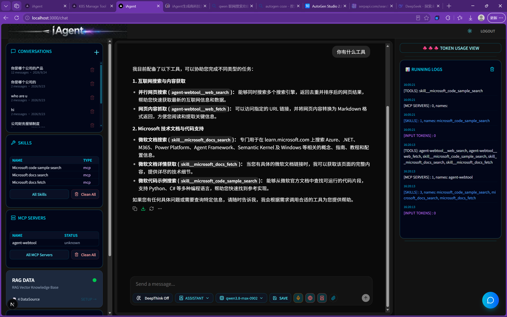
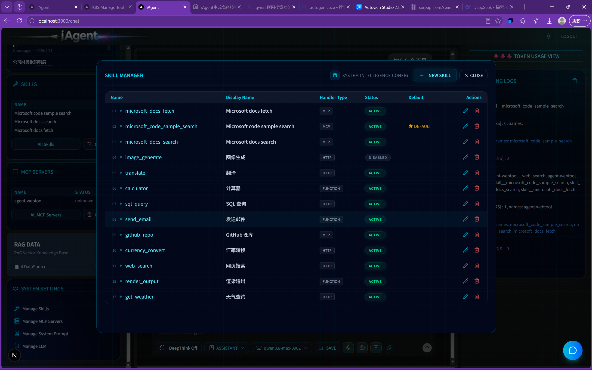
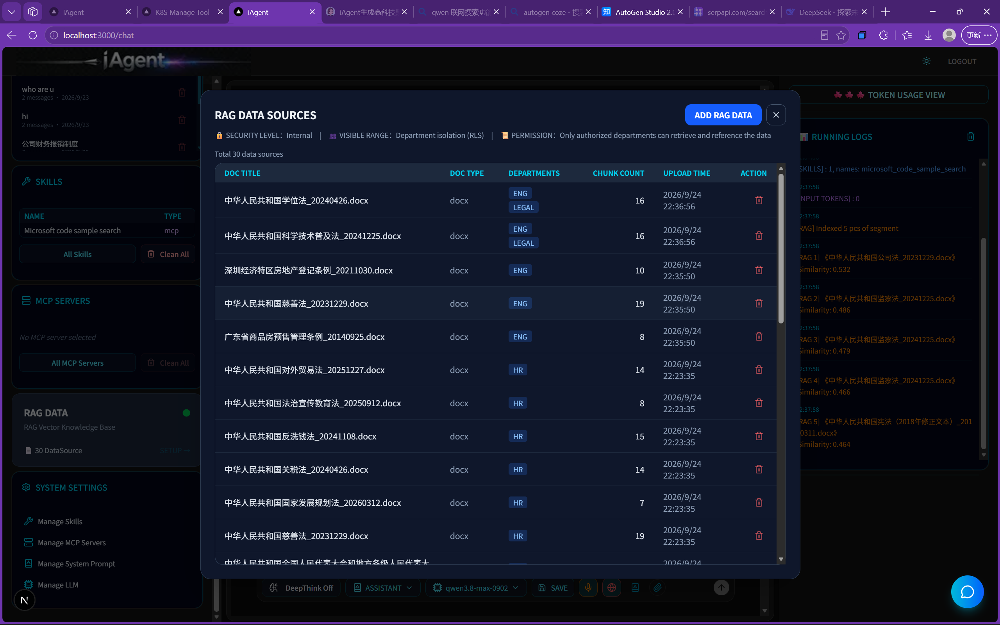
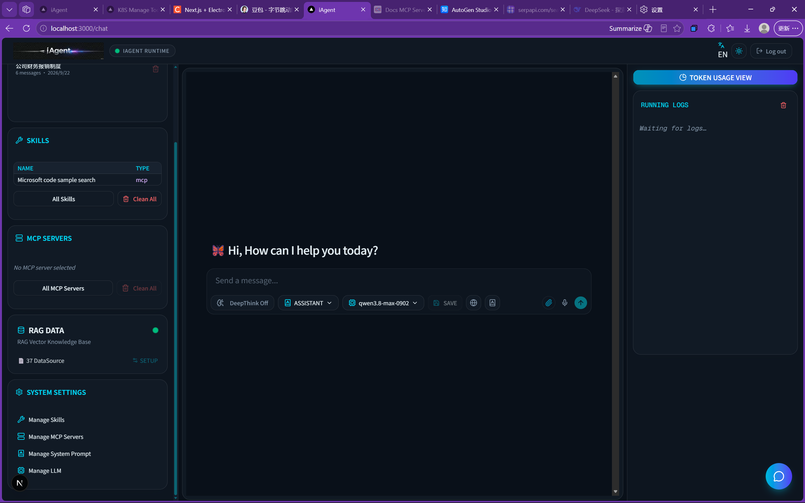

This is a [Next.js](https://nextjs.org) project bootstrapped with [`create-next-app`](https://nextjs.org/docs/app/api-reference/cli/create-next-app). it's design for build a integrated platform for central management of AI models, skills, MCP server, token usage etc. this
project design with including assistant-ui, tailwindCSS, typescript, postgreSQL, next.js, prisma, vercel AI-SDK. full stack development. pls kindly give your support and feedback if you like it. Email: m13692277450@outlook.com, support website: www.pavogroup.top, www.aipercy.top.

## Getting Started

First, run the development server:

```bash
npm run dev
# or
yarn dev
# or
pnpm dev
# or
bun dev
```

Open [http://localhost:3000](http://localhost:3000) with your browser to see the result.

You can start editing the page by modifying `app/page.tsx`. The page auto-updates as you edit the file.

This project uses [`next/font`](https://nextjs.org/docs/app/building-your-application/optimizing/fonts) to automatically optimize and load [Geist](https://vercel.com/font), a new font family for Vercel.

## Learn More

To learn more about Next.js, take a look at the following resources:

- [Next.js Documentation](https://nextjs.org/docs) - learn about Next.js features and API.
- [Learn Next.js](https://nextjs.org/learn) - an interactive Next.js tutorial.

You can check out [the Next.js GitHub repository](https://github.com/vercel/next.js) - your feedback and contributions are welcome!

## Deploy on Vercel

The easiest way to deploy your Next.js app is to use the [Vercel Platform](https://vercel.com/new?utm_medium=default-template&filter=next.js&utm_source=create-next-app&utm_campaign=create-next-app-readme) from the creators of Next.js.

Check out our [Next.js deployment documentation](https://nextjs.org/docs/app/building-your-application/deploying) for more details.

Design in progress



Token usage daily for each user:



Logs and MCP server 



MCP Server option


2026-09-16 UI update, Add MCP server option, Add skills selected card



2026-09-20 shift to assistant-UI, add dark/light mode, add Rag data upload, add save coversation history.



2026-09-24 add remote logger to log APP running conosle logs and append to database. add AI sevice robot to handle customer support. add mangement panel to CRUD skills, MCP servers, system_prompts, LLMs,.



CRUD UI of skills, MCP servers, system_prompts, LLMs, etc.



2026-09-24 add Rag data upload dialog,support multi files upload and progress bar.



2026-09-25 Add Microphone input option, pretty UI.
